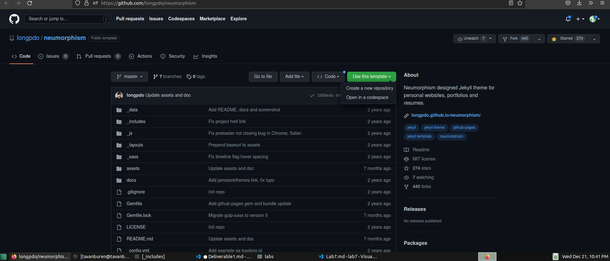

##Deliverable 1
---
### What is a static site generator?
----
A **static site generator** is a tool made to automate the creation of web pages. Using a template and data parameters a Static site generator can generate an HTML file for a specific purpose.

---
### What is Jekyll
---
Jekyll is a static site generator that has risen in popularity for its integration with github.

---

### What is github
---
Github is a for profit cloud service for hosting files using the open source distribution control program: git.

---
### How to install Jekyll in Ubuntu
---
Jekyll is installed using simple commands

|Command|Purpose|
|-------|-------|
|```sudo apt-get install ruby-full build-essential zlib1g-dev```| Download Ruby and all of the other prequesites|
|```echo '# Install Ruby Gems to ~/gems' >> ~/.bashrc echo 'export GEM_HOME="$HOME/gems"' >> ~/.bashrc echo 'export PATH="$HOME/gems/bin:$PATH"' >> ~/.bashrc source ~/.bashrc``` |Installs ruby gems to your home account |
| ```gem install jekyll bundler``` | Installs jekyll |

---
### Building a jekyll website

---
Jekyll websites have a file directory set to the following structure.

|Directory/file|Purpose|
|----------|------|
|_posts|Contains daily posts |
|_static|Contains the compiled website|
|about.markdown|The about page|
|index.markdown|The home page|
|404.html|Contains the 404 page|
|config.yml|Contains the sitewide

---
### Documenting the Process of building a site.

||
|:--:|
||
|Installing the prereqs|

||
|:--:|
|
|Installing Jekyll and using a command to create a website|
||
|
|A basic website, before and after testing ,making a new post|

---
## Deliverable 2-3
---

### Determining the client's needs

I approached the client with with two Jekyll themes. Hacker and Skinny Bones. 

https://github.com/pages-themes/hacker
https://github.com/mmistakes/jekyll-theme-skinny-bones


Neither one of them satisfied the client's request for a template that was portable and scalable to mobile.

After researching themes that were made with mobile in mind I came across neumorphism and the client immediately fell in love.

https://github.com/longpdo/neumorphism

 Neumorphism was made with mobile in mind and seemed to be somewhat easily convertible from its intended purpose as a personal resume to a site for the club.

### Creating a site using the template

I began by creating a fork and cloning the fork to my local machine.



In order to fulfill the needs of the client I had to start modifying the code of the template to reflect the needs of a club versus a personal resume.

||
||
|:--:|
|A template for skills repurposed to display the Eboard.|

### Closing Thoughts and reflection

Throughout the course of this project I learned how to create a site using a template in Jekyll. I also scratched the bare basics of learning HTML to modify that template to better suit my purposes.

https://tylervb-pccc-cis106.github.io/CIS-Club-neumorphism/