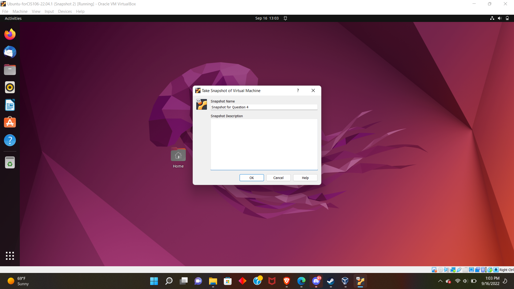

# Week 2 Report

## Summary of Presentations
This week the class was introduced to **Virtualization**. **Virtualization** is a method for emulating hardware by using software. A VM or **Virtual Machine** is the totality of the emulated computer. In class we were also introduced to the different methods of **virtualization** and their advantages and disadvantages.

### Different methods of Virtualization

#### Server Side Virtualization
In **Server Side Virtualization**, **Virtualization** takes place on a server and the display of the **Virtual Machine** is projected to a monitor in another location. PCCC uses **Server Side Virtualization** for the computers it provides on campus. **Server Side Virtualization** is advantageous in a school setting where you would want to see standardized environments for each student. It also makes the cost cheaper because we don't have to worry about complicated and expensive hardware being run into each classroom.

#### Client Side Virtualization
**Client Side Virtualization** is when the the VM is being run from the hardware in front of the user, as opposed to on a web server. One of the advantages of running a **Client Side Virtualization** environment is the lack of the need to be connected to a web server. This makes client side setups ideal as testing environments since you can break them without worrying about disrupting the access of other users.

##### Hyper Visors
**Hyper Visors** are software that are employed in **Client Side Virtualization**. They are used to manage virtualization environments and are categorized into two types. Type 1 **Hyper Visors** run from Hardware. Type 2 **Hyper Visors** run within a host OS. Type 1 **Hyper Visors** are obviously more efficient but I am using a type 2 for this course for ease and economic factors.

## How I applied what I learned in this course.
During this course's lab I installed Ubuntu onto a VM using my Laptop's Windows 11 OS. Using this virtual environment I conducted coursework such as updating my github, and typing this document. Provided below are screenshots for documentation.

