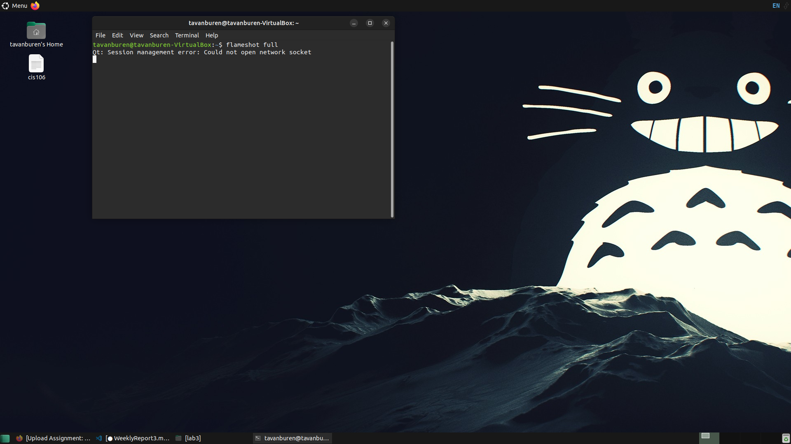

## Weekly Report 3

### Summary of presentations

This week, I learned about the variety of **Desktop Environments**(DE) that exist for the Linux Kernel, the **Bash scripting shell**, and commands for managing files through the terminal .

### Desktop Environments

A **Desktop Environment** is a **Graphical User Interface**(GUI) designed to make interaction with the computer easier for the user. DEs take inspiration from analog desktops, and many terms are common to their analog counterparts. While there is some standardization to these parts, **User Interface** design tends more towards an art than a science. Many competing DEs exist, each one tailored to different user needs. Some of the common parts of a DE include

* Display Manager
* File Manager
* Icons
* Favorites Bar
* Panels
* Menu

### The Bash Shell

The **Bash Scripting Shell** is a **Command Line Interface**(CLI) common to most Linux distros. **Comand Line Interface**s are a tool for the user to enter commands to an OS without going through a **GUI**. CLI's offer more power and control to users by allowing them to issue specific, direct commands without the need to navigate a complex graphical interface. **Bash** isn't the only **Shell**. Like DE's there are multiple competing environments. Multiple shells include:
* C Shell
* Korn Shell
* Z Shell
* D Shell
* Fish
  
#### Useful Bash Shortcuts

|Shortcut|Use                                  |
|--------|-------------------------------------|
| Ctrl+C |       Terminates the program        |
|   !!   |       Run Last Command              |
| Ctrl+L |       Clear the Screen              |
| Ctrl+R |       Search History Backwards      |
| Ctrl+G |       Exit History Search           |

#### Basic Commands And Their Usage

|Command|Use|
|-------|---|
|   ls  |Display all files in the current director|
|cd "dir"|Navigate to a specified directory        |
| mkdir |Make a new directory|
|date|Displays the date|
|uname|Displays information about the system|

### Managing Software

sudo apt update
sudo apt install
sudo apt remove
sudo apt search

#### Software Manager Vocab

##### Package

A **Package** is a prepackaged model of code. In windows packages typically come in the form of executables.

##### Library

A **Library** is a databse of many packages that are usually shared between programs.

##### Repository

A **Repository** is a server that hosts packages for download.

### How I applied what I learned this week
*  I swapped to Mate for the best color.
*  I downloaded a sick Totoro image and set it to my desktop
*  