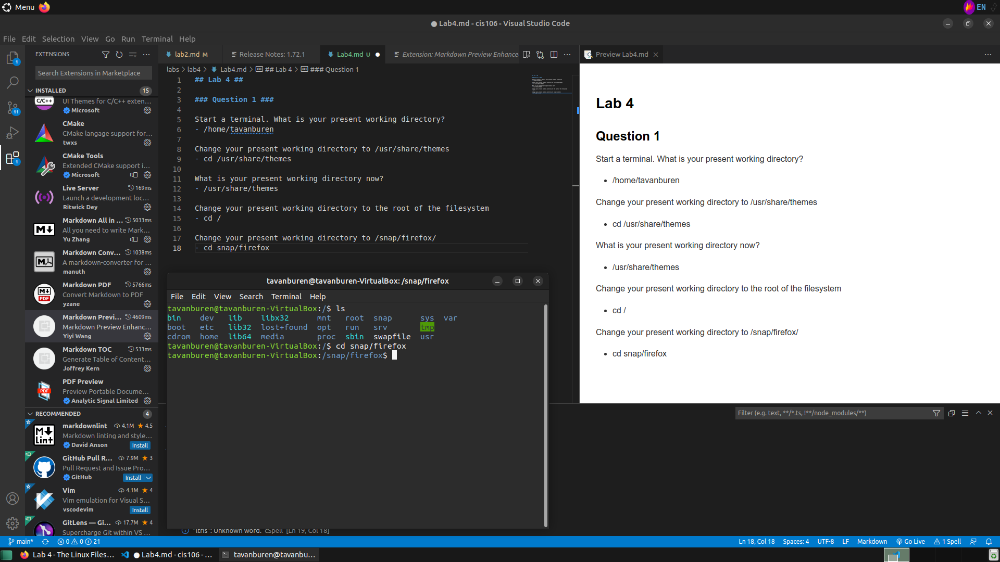

## Lab 4 ##
---
### Question 1 ###
---

Start a terminal. What is your present working directory?
- /home/tavanburen

Change your present working directory to /usr/share/themes
- cd /usr/share/themes

What is your present working directory now?
- /usr/share/themes

Change your present working directory to the root of the filesystem
- cd /

Change your present working directory to /snap/firefox/
- cd snap/firefox

Clear your terminal window. Change the working directory to YOUR home directory.
- clear
- cd ~

Change the working directory to the Downloads directory.
- cd Downloads

Go back 2 directories.
- cd ..
- cd ..

Where are you now?
- /home 

Change the working directory to the Documents/ directory.
-  cd tavanburen/Documents

---
### Question 2 ###
---

Change your present working directory to /usr/share/. Using absolute path, list all the files inside the lab4files directory.
- cd /usr/share
- ls home/tavanburen/lab4files

  
Change your present working directory to ~/lab4files. Long list all the files inside your current working directory with human readable file sizes.
- cd ~/lab4files
- ls -l -h

Long list all the files inside lab4files with human readable file size, and sorted by file size.
- ls -l -h -S

Long list all the files inside lab4files with human readable file size, sorted by file size, without the user nor the group name, and showing their inode number.
- ls -l -h -S -i -G -g

list all the files inside lab4files sorted by file extension and in reverse order.
- ls -X -r

[S15](Screenshots/Q2/Lab4Q2Screenshot5.png)

---
### Question 3
---

Using absolute path and having /etc as your present working directory. Display a tree of the directory lab4files.
- cd /etc
- tree /home/tavanburen/lab4files/

Change your present working directory to your Downloads directory. Display a tree of the directory lab4files with the full path prefix for each file, the file permissions, and the file size in human readable format.
- cd /home/tavanburen/Downloads/
- tree -f -p -h  /home/tavanburen/lab4files/

)

Display a tree of the directory lab4files sorted by last modified time and showing the file owner and group.
- tree -t -u -g  /home/tavanburen/lab4files/

)

Once you have installed exa, list all the options of the exa command.
- META OPTIONS
  -?, --help         show list of command-line options
  -v, --version      show version of exa

DISPLAY OPTIONS
  -1, --oneline      display one entry per line
  -l, --long         display extended file metadata as a table
  -G, --grid         display entries as a grid (default)
  -x, --across       sort the grid across, rather than downwards
  -R, --recurse      recurse into directories
  -T, --tree         recurse into directories as a tree
  -F, --classify     display type indicator by file names
  --colo[u]r=WHEN    when to use terminal colours (always, auto, never)
  --colo[u]r-scale   highlight levels of file sizes distinctly
  --icons            display icons
  --no-icons         don't display icons (always overrides --icons)

FILTERING AND SORTING OPTIONS
  -a, --all                  show hidden and 'dot' files
  -d, --list-dirs            list directories as files; don't list their contents
  -L, --level DEPTH          limit the depth of recursion
  -r, --reverse              reverse the sort order
  -s, --sort SORT_FIELD      which field to sort by
  --group-directories-first  list directories before other files
  -D, --only-dirs            list only directories
  -I, --ignore-glob GLOBS    glob patterns (pipe-separated) of files to ignore
  Valid sort fields:         name, Name, extension, Extension, size, type,
                             modified, accessed, created, inode, and none.
                             date, time, old, and new all refer to modified.

LONG VIEW OPTIONS
  -b, --binary         list file sizes with binary prefixes
  -B, --bytes          list file sizes in bytes, without any prefixes
  -g, --group          list each file's group
  -h, --header         add a header row to each column
  -H, --links          list each file's number of hard links
  -i, --inode          list each file's inode number
  -m, --modified       use the modified timestamp field
  -n, --numeric        list numeric user and group IDs
  -S, --blocks         show number of file system blocks
  -t, --time FIELD     which timestamp field to list (modified, accessed, created)
  -u, --accessed       use the accessed timestamp field
  -U, --created        use the created timestamp field
  --changed            use the changed timestamp field
  --time-style         how to format timestamps (default, iso, long-iso, full-iso)
  --no-permissions     suppress the permissions field
  --octal-permissions  list each file's permission in octal format
  --no-filesize        suppress the filesize field
  --no-user            suppress the user field
  --no-time            suppress the time field
  -@, --extended       list each file's extended attributes and sizes

---
### Question 4 ###
---

Open a new terminal. What is your present/current working directory?
- /home/tavanburen

Change your present/current working directory to the default directory located inside /usr
- cd /usr/share/icons/default

Change your present/current working directory to the ipv4 directory located inside /proc
- cd /proc/sys/net/ipv4

change your present/current working directory to the previous present/working directory.
- cd -

List all the files inside share/backgrounds without changing your present working directory.
- ls /usr/share/backgrounds

List all the files inside your cis106 directory located in YOUR home directory.
- ls ~/cis106

List all the files inside your Downloads directory. Your present working directory has to be /home before your can list all the files.
- cd /home
- ls tavanburen/Downloads

Change your present/current working directory to disk/by-id and from there long list all the files in your home directory including hidden files.
- cd /dev/disk/by-id
- ls -a /home

List all the files sorted by modification time inside the share/themes directory.
- ls -t /usr/share/themes
 

List all the files sorted by file extension inside the /usr/share directory.
- ls -x /usr/share

