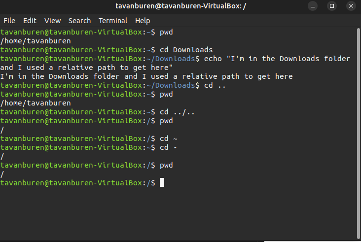

## Weekly Report 4 ##
---
### Question 1 ###
---

---
### Question 2 ###
---
|Directory|Data Stored in Directory|
|---------|------------------------|
|bin| Stores binary executables which are essential for running Linux |
|dev| Stores information that is pertinent to devices |
|etc| Stores files that contain system configuration settings|
|home| User home directory |
|media| Mounts storage devices |
|opt| Stores optional software packages|
|proc| Psuedo file system used by the kernel as a control center. |
|srv| Stores information that is used by services which run on the system |
|usr| Stores software that is NOT required for system functionality |
|var| Stores variables that are important enough to not be lost on system reboot |

|Command|What it does|Syntax|Example|Ex. Explained|
|-|-|-|-|-|
| echo|Displays a string to the screen | `echo` + `option` + `text to display` | `echo "I love using bash"`| Prints the string "I love using bash" to the terminal|
| apt |Summons apt, a package manager | `sudo` + `apt` + `option` + `package` | `sudo apt purge expak` | Installs the package "expack"|
| uname | Prints system information | `uname` + `option` | `uname -r` | Prints kernel information using the -r option |
| pwd |Print information about the current working directory | `pwd` + `option` |`pwd -P` | Print the current working directory and avoid all symlinks |
| cd | Changes the current directory | `cd` + `path to a directory(relative or absolute)`| `cd /` | Changes the directory to root |
| ls | Lists the content of the current folder | `ls` + `options` + `directory` | `ls -l /dev` | Long lists the content of the dev folder

### Summary ###

#### Definitions ####

**File System**: A file system is a system for storing, sorting, and navigating files.

**Current Directory**: The directory that a user is currently working from. Commands in terminal will be executed from within this directory.

**Parent Directory**: The directory containing a given directory. For example root contains home, making root the parent of home.

**Home Directory**: Where all users have their data

**Your Home Directory**: Where a specific user has their data stored

**Path name**: The path used to access a file or directory

**Relative path**: The path of a file or directory  *RELATIVE*  to the **Current Directory**

**Absolute path**: The path as determined from the **Root Directory**

Commands used for navigating the file system

- cd
- ls
- pwd

### How I applied what I learned this week ###

I didn't really apply any of these concepts into my every day Linux experience. However I now have many ideas for scripts to make managing all my downloads much easier.