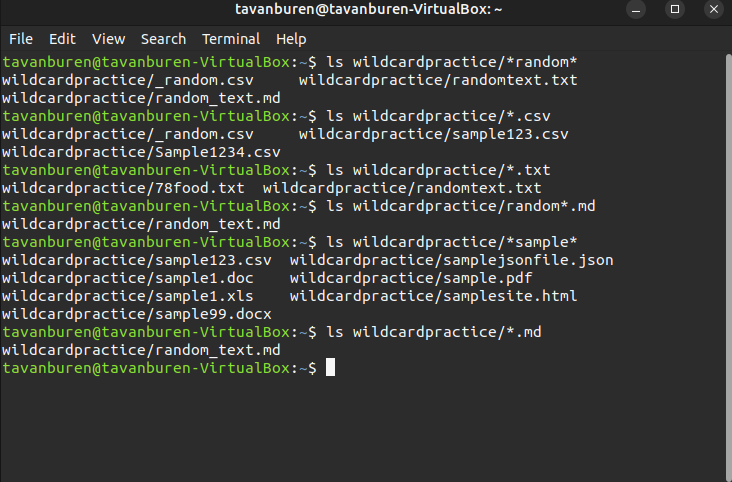
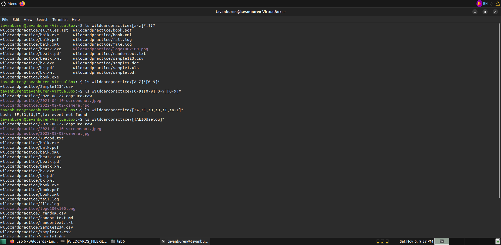
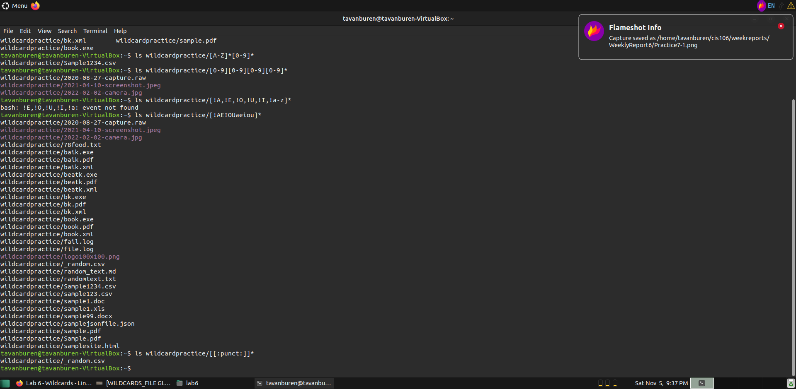

## Weekly report 6

### Wild Cards

#### *

\* is used to represent any sequence of characters.
|Command|Explanation|
|-------|-----------|
|```ls *.txt```| show all txt files
|```ls \*chocolate\*```| show all files with chocolate in the name
|```ls \*A.\*```| show all files that have "A" before the extension

#### ?

? is used to represent a single character.
|Command|Explanation|
|-------|-----------|
|```ls -A .??``` |show all files with a two character extension|
|```ls -A ????.*``` |show all files with a 4 character name|
|```ls -A .??* ```|show all hidden files|

#### []

[] is used to represent a range of characters.
|Command|Explanation|
|-------|-----------|
|```ls [A-Z]*```| show all files that begin with a capital
|```ls [!e,!E]\*```| show all files that do not start with the letter E in capital or lowercase
|```ls [0-9][0-9][0-9][0-9]*```| show all files that begin with a sequence of four digits

### Brace Expansion

#### {}

{} is used to expand one command into multiple commands

|Command|Explanation|
|-------|-----------|
|```echo Bracket A{ugmentation,llows,mazing,lliteration}```| Alliteration shows the amount of typing saved in an easily digestible way. One character for each word.
|```touch Book{1,2,3,4,5,6,7,8,9}.txt```| Creates 9 numbered book files|
|```mkdir -p mkdir -p ~/College/{CIS{-106_Linux_Fundamentals/,-260_Data_Structures/},PY-120_Physics/}{Homework,Materials,Notes}```| Creates a directory for Several college courses. College branches into CIS and PY-120_Physics. CIS branches into two classes. CIS AND PY then branch into Homework, Material, and Notes.

### Practice






### Final thoughts

I enjoy bracket expansion. Need to think about it some more but it seems theres lots of creative ways to apply it.